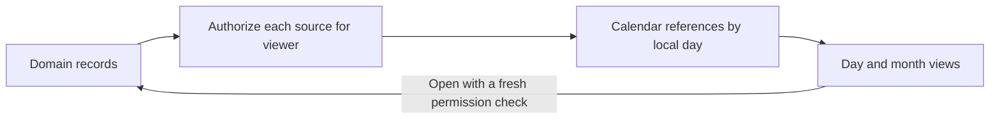
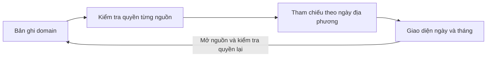

# Relationship Calendar / Lịch và dòng thời gian của tụi mình

## English

### 1. Feature description

A future daily/monthly relationship timeline answering “What happened today?” and “What has our relationship looked like recently?” It summarizes authorized sources rather than recreating Google Calendar. Follow [shared conventions](README.md#proposed-engineering-conventions).

### 2. User experience / expected behavior

Choose a month, open a day, and see permitted moods, kisses, apologies, memories, activity completions/seminars, important occasions and owner-authorized period information. Select an item to open its source inside the private experience. Quiet days show a neutral empty state. Optional weekly/monthly summaries describe events, never relationship quality.

### 3. Functional requirements

MVP: month grid and daily list from whatever source features exist, manual shared occasions, date navigation, and type filters. Calendar reads are projections; source features own create/edit/archive. Counts may include memories, completed activities, kisses, apologies and mood distribution only within accessible records. Mood summaries show distributions and record counts, not scores; missing input is not zero emotion. Use ISO UTC instants with captured zone and date-only values for all-day events. Display initially in `Asia/Bangkok` (UTC+07:00); no fixed offset in domain data.

### 4. Architecture

Suggested `backend/calendar.js` queries bounded authorized source ranges and returns normalized references, then `js/calendar.js` renders month/day views. Do not store copies of mood notes, apology reasons or memory stories. Add a small adapter for each implemented source, not an all-purpose event bus. Missing optional sources contribute nothing. Keep `CalendarEvent` storage only for manually created occasions. Pure date/grouping functions can be tested without a browser.

### 5. Suggested data model

Manual `CalendarEvent { id, authorId, title, description?, date, kind: occasion|anniversary|milestone, createdAt, updatedAt, archivedAt?, version }` (title 120, description 1000 suggested characters).

Derived `CalendarItem { sourceType, sourceId, date, occurredAt?, displayTitle, ownerId?, permittedSummary? }`; transient `CalendarDay { date, items[], countsByType }`. No persisted calendar copy for each source entry. Period estimates, if added later, have `isEstimated: true` and stay separate from recorded events. Recurring anniversaries require an explicit later recurrence rule; MVP stores individual dates.

### 6. Frontend responsibilities

Accessible month controls and day buttons, clear selected date, textual counts, type filters, today action and mobile daily view. Never hide information behind color alone. Empty/error/retry states distinguish “no accessible events” from failure, without hinting at hidden records. Abort range requests, discard stale month results, clear on identity changes; keep sensitive detail out of URL/hash and public shell labels.

### 7. Backend/API responsibilities

Proposed `GET /api/calendar?from=&to=&types=` returns `{ days, nextCursor }` grouped in the agreed display zone, with authorized counts and bounded result pagination. `GET/POST /api/calendar-events`, `GET/PUT /api/calendar-events/:id`, `POST /api/calendar-events/:id/archive` handle manual occasions. Each range is at most 93 days with inclusive start/exclusive end; validate types, date bounds, pagination and text. Server identity checks precede source queries and aggregation; no hidden totals. Author edits own manual events by recommendation; collaborative editing is an open decision. Recheck permission when opening source detail; return neutral unavailable for revoked references.

### 8. Important edge cases

UTC midnight may belong to the next Bangkok day. Leap days, month boundaries, backdated events, changed event dates and identical timestamps must group consistently. Archiving/permission revocation removes items and counts together. A partial source failure must be labelled as partial (not a misleading zero); do not expose private source details in failure text. Different viewers can legitimately see different calendars.

### 9. Privacy / permission considerations

Only members read relationship calendar; each sees their own private moods/journal references and explicitly shared partner data. Private journal titles should remain owner-only even when a separate shared post exists. Yến sees her period records; Minh sees nothing, including counts/icons, unless a future grant allows the exact summary. Public garden/profile endpoints must not expose calendar output.

**Open Design Decision:** personal and shared items in one filtered view offers context but risks confusion; separate “mine” and “ours” views clarify audience but add navigation. Recommend one view with explicit scope labels and filters. Manual-event co-editing versus author-only edits must also be confirmed.

### 10. TODO checklist

#### Phase 1 — Domain (MVP)

- [ ] Define reference DTO, date/range/timezone semantics and visible count rules.
- [ ] Confirm scope UI and ownership of manual occasions.

#### Phase 2 — Backend (MVP)

- [ ] Add manual-event persistence/validation and authenticated routes.
- [ ] Add adapters only for existing sources, permission-first grouping and bounded pagination.

#### Phase 3 — Frontend (MVP)

- [ ] Render month/day controls, scope labels, filters, source opening and partial/error states.
- [ ] Guard racing range requests and identity cleanup.

#### Phase 4 — Integration

- [ ] Connect Mood, Memories, kiss/apology and activity sources as each ships.
- [ ] Connect Period Tracker only through its authorized summary projection.

#### Phase 5 — Tests / later

- [ ] Test time boundaries, all permission combinations, revoked items/counts and partial failures.
- [ ] Later: specify recurrence, summaries and portable timeline export.

### 11. Testing requirements

Node pure-function and HTTP tests: leap dates, Sunday/Monday boundary, UTC/Bangkok midnight, date-only roundtrip, duplicate IDs across source types, range caps/cursors, deleted sources, failure states and permission-filtered counts. Browser: keyboard month/day flow, readable small screens, rapid month changes, source unavailable states and logout clearing. Test with one source installed and with multiple integrations; do not require unfinished features.

### 12. Future extensions

Optional recurring anniversaries, bounded weekly/monthly descriptive summaries, portable export and personal/shared scope views. No external calendar sync, relationship-health score or duplicated source database is assumed.

---

## Tiếng Việt

### 1. Mô tả tính năng

Lịch ngày/tháng tương lai trả lời “Hôm nay đã có gì?” và “Gần đây tụi mình đã trải qua thế nào?”. Lịch tổng hợp nguồn đúng quyền, không làm lại Google Calendar. Theo [quy ước chung](README.md#quy-ước-kỹ-thuật-được-đề-xuất).

### 2. Trải nghiệm / hành vi mong đợi

Chọn tháng/ngày để xem mood, nụ hôn, lời xin lỗi, kỷ niệm, hoạt động/seminar hoàn thành, dịp quan trọng và thông tin kỳ kinh đúng quyền. Chọn mục để mở nguồn trong không gian riêng. Ngày yên lặng có trạng thái trống trung tính. Tổng hợp tuần/tháng tùy chọn chỉ mô tả sự kiện, không chấm điểm tình cảm.

### 3. Yêu cầu chức năng

MVP: lưới tháng, danh sách ngày từ nguồn đã có, dịp chung nhập tay, chuyển ngày và lọc loại. Lịch là projection đọc; nguồn sở hữu create/edit/archive. Count có thể gồm kỷ niệm, hoạt động hoàn thành, nụ hôn, lời xin lỗi, phân bố mood trong bản ghi được đọc. Mood hiện phân bố/count, không điểm số; chưa nhập không có nghĩa cảm xúc bằng không. Giờ lưu UTC ISO và zone; sự kiện cả ngày giữ ngày thuần. Ban đầu hiển thị `Asia/Bangkok` UTC+07:00, không hard-code offset vào domain.

### 4. Kiến trúc

Gợi ý `backend/calendar.js` query range đúng quyền, trả tham chiếu chuẩn hóa; `js/calendar.js` render tháng/ngày. Không copy note mood, lý do xin lỗi, story Memory. Mỗi nguồn có adapter nhỏ khi đã triển khai, không event bus tổng quát. Nguồn chưa có không đóng góp dữ liệu. `CalendarEvent` chỉ lưu dịp nhập tay. Hàm nhóm ngày thuần có thể test không cần browser.

### 5. Mô hình dữ liệu gợi ý

Nhập tay: `CalendarEvent { id, authorId, title, description?, date, kind: occasion|anniversary|milestone, createdAt, updatedAt, archivedAt?, version }`, gợi ý title 120, description 1000 ký tự.

Suy ra: `CalendarItem { sourceType, sourceId, date, occurredAt?, displayTitle, ownerId?, permittedSummary? }`; `CalendarDay { date, items[], countsByType }` tạm thời. Không lưu bản sao lịch cho từng bản ghi nguồn. Ước tính kỳ kinh sau này có `isEstimated: true`, tách dữ liệu đã ghi. Anniversary lặp cần rule riêng về sau; MVP lưu từng ngày.

### 6. Trách nhiệm frontend

Nút tháng/ngày accessible, ngày được chọn rõ, count bằng chữ, filter loại, nút hôm nay và daily view trên mobile. Không chỉ dùng màu. Trạng thái trống/lỗi/retry phân biệt “không có mục được xem” với lỗi, không gợi ý dữ liệu bị ẩn. Abort request range, bỏ response tháng cũ, xóa khi đổi người; không đặt detail nhạy cảm trong URL/hash/nhãn shell public.

### 7. Trách nhiệm backend/API

Đề xuất `GET /api/calendar?from=&to=&types=` trả `{ days, nextCursor }` nhóm theo zone thống nhất, count đúng quyền, phân trang có giới hạn. `GET/POST /api/calendar-events`, `GET/PUT /api/calendar-events/:id`, `POST /api/calendar-events/:id/archive` cho dịp nhập tay. Range tối đa 93 ngày, gồm đầu/không gồm cuối; validate type/ngày/phân trang/chữ. Kiểm tra identity trước query/tổng hợp, không count ẩn. Đề xuất tác giả sửa dịp của mình; đồng sửa còn mở. Mở detail kiểm tra quyền lại; nguồn thu hồi hiện unavailable trung tính.

### 8. Tình huống biên quan trọng

UTC nửa đêm có thể thuộc ngày sau tại Bangkok. Ngày nhuận, ranh giới tháng, nhập quá khứ, sửa ngày và cùng timestamp phải nhóm đúng. Archive/thu hồi quyền gỡ cả item/count. Một nguồn lỗi phải báo thiếu một phần, không hiển thị zero giả; lỗi không lộ detail riêng. Hai người có thể thấy lịch khác nhau hợp lệ.

### 9. Riêng tư / phân quyền

Chỉ thành viên xem lịch; mỗi người đọc mood/tham chiếu nhật ký riêng của mình và dữ liệu partner đã share. Title nhật ký riêng vẫn chỉ owner đọc dù có bài snapshot riêng. Yến xem kỳ kinh; Minh không thấy count/icon nào nếu chưa có grant cho đúng summary. API vườn/hồ sơ public không trả dữ liệu lịch.

**Open Design Decision / Quyết định thiết kế còn mở:** một view lọc nội dung riêng/chung giữ ngữ cảnh nhưng dễ nhầm quyền; view “của mình” và “tụi mình” riêng rõ hơn nhưng thêm điều hướng. Đề xuất một view có nhãn phạm vi/filter. Cũng cần chốt đồng sửa hay chỉ tác giả sửa dịp nhập tay.

### 10. Checklist TODO

#### Giai đoạn 1 — Domain (MVP)

- [ ] DTO tham chiếu, ngày/range/zone và count được phép.
- [ ] Chốt UI phạm vi, quyền dịp nhập tay.

#### Giai đoạn 2 — Backend (MVP)

- [ ] Lưu/validate dịp nhập tay và route authenticated.
- [ ] Adapter nguồn đã có, nhóm sau kiểm tra quyền, phân trang giới hạn.

#### Giai đoạn 3 — Frontend (MVP)

- [ ] Control tháng/ngày, nhãn phạm vi, filter, mở nguồn, lỗi/partial.
- [ ] Chặn race request range và xóa khi đổi danh tính.

#### Giai đoạn 4 — Tích hợp

- [ ] Nối Mood/Memory/nụ hôn/xin lỗi/hoạt động khi từng nguồn được triển khai.
- [ ] Kỳ kinh chỉ qua summary đã lọc đúng grant.

#### Giai đoạn 5 — Test / sau

- [ ] Test ranh giới ngày, mọi quyền, thu hồi item/count, lỗi nguồn một phần.
- [ ] Sau: recurrence, tổng hợp, export timeline portable.

### 11. Yêu cầu kiểm thử

Node thuần/HTTP: ngày nhuận, Chủ nhật/thứ Hai, UTC/Bangkok nửa đêm, ngày thuần roundtrip, ID trùng ở nguồn khác loại, range/cursor, nguồn xóa/lỗi, count đúng quyền. Browser: tháng/ngày bằng bàn phím, màn hình nhỏ, chuyển tháng nhanh, nguồn unavailable, logout. Test với một nguồn hoặc nhiều tích hợp; không buộc làm tính năng chưa có.

### 12. Mở rộng tương lai

Anniversary lặp tùy chọn, tổng hợp mô tả tuần/tháng, export và view riêng/chung. Không mặc định sync lịch ngoài, điểm sức khỏe mối quan hệ hoặc database sao chép nguồn.
