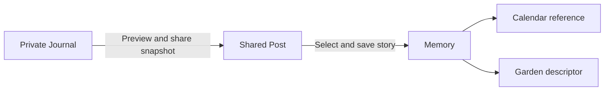
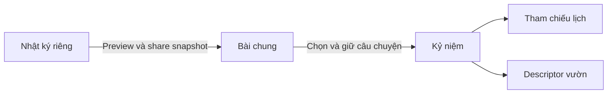

# Memories / Kỷ niệm

## English

### 1. Feature description

Journal asks “What am I thinking or experiencing?”; Shared Post asks “What are we currently sharing/talking about?”; Memory asks “What do we want our future selves to remember?” This future collection is curated, not an automatic archive of everything. Follow [shared conventions](README.md#proposed-engineering-conventions).

### 2. User experience / expected behavior

Create a text memory directly, or select “Save as Memory” on an authorized [Playground](02-shared-playground.md) post. Preview/select the story, title, date, participants and tags before saving. Return later to read or revise the story and optionally choose a [garden](10-garden-integration.md) representation. The [Calendar](04-relationship-calendar.md) points to the memory's event date, not the day it was saved.

### 3. Functional requirements

MVP: text title/story, date-only `eventDate`, participants from the two fixed users, tags, create/read/edit/archive and pagination. Suggested title 120 characters, story 4000, 10 tags of 30; byte cap still applies. Proposed editing default: both partners may edit shared memories with version conflicts. Source-post conversion is a separate integration; use one active linked Memory per source post by recommendation to avoid accidental duplicates. Media remains references only until a durable protected-media decision.

### 4. Architecture

Suggested `js/memories.js`, `backend/memories.js`. Input/preview -> validated curation -> durable Memory record -> authorized API -> collection/detail -> calendar/garden references. Store the curated text story as Memory-owned content because it can differ from the post; provenance and media are references. This purposeful text snapshot is not a second media upload. Journal-derived memories retain a revocable source dependency. No Journal or Playground is needed for standalone text memories.

### 5. Suggested data model

`Memory { id, createdBy, title, story, eventDate, participantIds[], tags[], sourcePostId?, sourcePostVersion?, mediaIds[], gardenOptIn: false, createdAt, updatedAt, archivedAt?, version }`.

Reference source permissions at read time; a stored snapshot cannot override revocation. `sourcePostVersion` records the selected version and does not subscribe to future post edits. Garden descriptors are derived from this record; no stored flower story. Future comments/reactions are separate author-owned records. Location is a later optional field, never inferred from photos by default.

### 6. Frontend responsibilities

Accessible curation form, preview and clear shared audience; no automatic preservation of whole conversations. Collection/detail states, version-conflict review, archive confirmation, loading/error and in-memory drafts. Source links must fail safely when unavailable. Do not display or prefetch restricted source content; clear data on identity changes and clean up async work.

### 7. Backend/API responsibilities

Proposed `GET/POST /api/memories`, `GET/PUT /api/memories/:id`, `POST /api/memories/:id/archive`; integration `POST /api/posts/:id/save-memory` accepts curation fields, source version and `requestId`. Validate text, dates, participants, media/source access, versions and exact fields. All reads require membership and live source/grant checks. Conversion atomically writes Memory/provenance/deduplication outcome, referencing existing authorized `mediaIds`. Reject a revoked or changed source with a conflict/unavailable response rather than preserving hidden text.

Recommend both-member editing but author-only archiving for MVP, pending the decisions below. No irreversible DELETE route is proposed. Archive removes active calendar/garden projections. Journal-source revocation hides the entire dependent memory story/media from the partner until renewed explicit sharing; preserve it privately for the source owner rather than silently converting it into an independent shared memory. Post edits do not rewrite the Memory automatically.

### 8. Important edge cases

Retry conversion returns the same Memory. A previously archived conversion may be restored explicitly or a replacement allowed after a chosen policy; do not silently duplicate. One media asset can have multiple authorized parents; deleting one reference must not delete bytes still referenced elsewhere. A missing source is shown without leaking its private title. Concurrent co-editing needs a merge/review UI or explicit reload, not last-write-wins. Changed event dates regroup calendar items.

### 9. Privacy / permission considerations

Memories are shared between the two members, never public. Saving one does not make a private journal public or permanently bypass source consent. Media access checks apply to every parent link. Sensitive period data is excluded from Memory conversion by default. Portable export must re-evaluate source permissions and exclude revoked partner data.

**Open Design Decision:** both-person editing supports a shared story but needs conflicts/history; creator-only editing is simpler. Recommend both with versions. **Open Design Decision:** either person deleting a Memory gives equal control but may destroy the other's keepsake; creator-only archive or bilateral deletion preserves agency with more steps. Recommend reversible creator-only archive in MVP and defer hard deletion until agreement/retention rules are selected. Confirm who may restore archived records and whether a source can have multiple Memories.

### 10. TODO checklist

#### Phase 1 — Domain (MVP)

- [ ] Confirm edit/archive/restore rights, source cardinality and text/date schema.
- [ ] Define independent versus source-dependent Memory access and retention.

#### Phase 2 — Backend (MVP)

- [ ] Add shared Memory persistence, validated list/detail/create/update/archive endpoints.
- [ ] Add participant checks, version conflicts, retry deduplication and durable failure handling.

#### Phase 3 — Frontend (MVP)

- [ ] Build text curation/list/detail, audience labels, conflict and archive flows.
- [ ] Add abort/identity cleanup and accessible mobile states.

#### Phase 4 — Integration

- [ ] Implement post-to-Memory transaction and revocation tests with Playground.
- [ ] Expose references to Calendar and opted-in descriptors to Garden.

#### Phase 5 — Tests / later

- [ ] Test source permissions, race/retry behavior and independent text memories.
- [ ] Later: select protected media storage, comments/reactions, export and deletion policy.

### 11. Testing requirements

Node: guest denial, two-member edit matrix, invalid participants/dates/media, conflicts, source-version races, retry uniqueness, source revoke/unshare, archive/restore, durable restart and reused media reference retention. Browser: conversion preview, stale-source errors, conflict preserves draft, safe text, timeline date change, keyboard/mobile and logout cleanup. Garden/media integration tests run only with those implemented features.

### 12. Future extensions

Photos/video through one protected `MediaAsset`, comments/reactions, optional location, revision history, portable JSON export with a media manifest, and chosen garden representations. No automatic public album or permanent copies of revoked private content.

---

## Tiếng Việt

### 1. Mô tả tính năng

Nhật ký hỏi “Mình đang nghĩ hay trải qua điều gì?”; bài chung hỏi “Tụi mình đang chia sẻ/bàn về gì?”; Kỷ niệm hỏi “Mình muốn bản thân tương lai nhớ điều gì?”. Bộ sưu tập tương lai được chọn lọc, không tự lưu mọi thứ. Theo [quy ước chung](README.md#quy-ước-kỹ-thuật-được-đề-xuất).

### 2. Trải nghiệm / hành vi mong đợi

Tạo kỷ niệm chữ trực tiếp hoặc “Giữ làm kỷ niệm” từ bài [Góc chia sẻ](02-shared-playground.md) đúng quyền. Preview/chọn story, title, ngày, người tham gia và tag trước khi lưu. Sau này đọc/sửa câu chuyện, tùy chọn hình ảnh trong [vườn](10-garden-integration.md). [Lịch](04-relationship-calendar.md) tham chiếu ngày xảy ra, không ngày bấm lưu.

### 3. Yêu cầu chức năng

MVP: title/story chữ, `eventDate` ngày thuần, participants trong hai user cố định, tag, tạo/xem/sửa/archive/phân trang. Gợi ý title 120, story 4000 ký tự, 10 tag dài 30; vẫn giới hạn byte. Đề xuất cả hai sửa Memory chung với version conflict. Chuyển từ post là tích hợp riêng; đề xuất một Memory đang hoạt động cho mỗi post để tránh lặp. Media chỉ là tham chiếu cho tới khi chốt storage bền và riêng.

### 4. Kiến trúc

Gợi ý `js/memories.js`, `backend/memories.js`. Input/preview -> validate -> lưu Memory bền -> API đúng quyền -> collection/detail -> tham chiếu lịch/vườn. Story được lưu riêng vì có thể khác post; provenance/media dùng link. Snapshot chữ có chủ đích không phải upload media lần nữa. Memory từ nhật ký giữ phụ thuộc nguồn có thể thu hồi. Memory chữ độc lập không cần Nhật ký/Góc chia sẻ.

### 5. Mô hình dữ liệu gợi ý

`Memory { id, createdBy, title, story, eventDate, participantIds[], tags[], sourcePostId?, sourcePostVersion?, mediaIds[], gardenOptIn: false, createdAt, updatedAt, archivedAt?, version }`.

Đọc kiểm tra quyền nguồn hiện tại; snapshot không ghi đè thu hồi. `sourcePostVersion` ghi phiên bản đã chọn, không tự theo sửa đổi post. Vườn suy ra descriptor, không lưu story vào hoa. Comment/reaction tương lai là bản ghi riêng theo tác giả. Location là field sau, không mặc định suy ra từ ảnh.

### 6. Trách nhiệm frontend

Form chọn lọc accessible, preview và nhãn hai người cùng xem; không tự giữ toàn bộ hội thoại. Collection/detail, xem lại conflict, xác nhận archive, loading/lỗi/nháp RAM. Link nguồn lỗi an toàn khi unavailable. Không render/prefetch nội dung sai quyền; xóa khi đổi người, cleanup async.

### 7. Trách nhiệm backend/API

Đề xuất `GET/POST /api/memories`, `GET/PUT /api/memories/:id`, `POST /api/memories/:id/archive`; tích hợp `POST /api/posts/:id/save-memory` nhận field chọn lọc, version nguồn và `requestId`. Validate chữ/ngày/participants/quyền media-nguồn/version/field. Mọi read cần membership và quyền nguồn/grant còn hiệu lực. Conversion lưu Memory/provenance/kết quả chống lặp atomic, dùng `mediaIds` đã được phép. Nguồn đổi/thu hồi trả conflict/unavailable, không giữ chữ bị ẩn.

Đề xuất cả hai sửa nhưng chỉ creator archive trong MVP, chờ quyết định bên dưới. Chưa đề xuất DELETE không thể phục hồi. Archive gỡ projection lịch/vườn hoạt động. Thu hồi nguồn nhật ký ẩn toàn story/media Memory phụ thuộc khỏi partner tới khi được share lại; giữ riêng cho owner nguồn, không tự biến thành Memory chung độc lập. Sửa post không tự sửa Memory.

### 8. Tình huống biên quan trọng

Retry conversion trả cùng Memory. Conversion đã archive cần restore rõ ràng hoặc policy tạo thay thế, không tự nhân bản. Một media có nhiều parent; gỡ một link không xóa file còn nơi khác dùng. Nguồn mất không lộ title riêng. Đồng sửa cần review/merge hoặc reload rõ, không ghi sau thắng. Đổi ngày sự kiện cập nhật nhóm lịch.

### 9. Riêng tư / phân quyền

Kỷ niệm chỉ chung hai người, không public. Lưu không công khai nhật ký riêng hoặc bỏ qua consent nguồn mãi mãi. Media kiểm tra từng parent. Không mặc định chuyển dữ liệu kỳ kinh vào Memory. Export kiểm tra lại quyền và loại dữ liệu partner đã thu hồi.

**Open Design Decision / Quyết định thiết kế còn mở:** cả hai sửa giúp kể chuyện chung nhưng cần conflict/history; creator-only đơn giản hơn. Đề xuất cả hai với version. **Open Design Decision:** ai cũng xóa cho quyền ngang nhau nhưng có thể mất kỷ vật của người kia; chỉ creator archive hoặc xóa cần cả hai đồng ý giữ quyền tốt hơn nhưng nhiều bước. Đề xuất MVP archive phục hồi được bởi creator, hoãn hard delete tới khi chốt agreement/retention. Cần chốt người được restore và một nguồn có được tạo nhiều Memory không.

### 10. Checklist TODO

#### Giai đoạn 1 — Domain (MVP)

- [ ] Chốt edit/archive/restore, số Memory/nguồn, schema chữ/ngày.
- [ ] Quyền và retention của Memory độc lập/phụ thuộc nguồn.

#### Giai đoạn 2 — Backend (MVP)

- [ ] Lưu Memory chung, route list/detail/create/update/archive có validate.
- [ ] Participants, version conflict, chống retry lặp, xử lý lưu bền thất bại.

#### Giai đoạn 3 — Frontend (MVP)

- [ ] Form/list/detail chữ, nhãn quyền, conflict/archive.
- [ ] Abort/xóa theo danh tính, trạng thái mobile accessible.

#### Giai đoạn 4 — Tích hợp

- [ ] Transaction post-to-Memory và test thu hồi cùng Góc chia sẻ.
- [ ] Tham chiếu Lịch, descriptor Vườn có opt-in.

#### Giai đoạn 5 — Test / sau

- [ ] Test nguồn/quyền/race/retry và Memory chữ độc lập.
- [ ] Sau: storage media riêng, comment/reaction, export/chính sách xóa.

### 11. Yêu cầu kiểm thử

Node: guest, quyền sửa hai người, participants/ngày/media sai, conflict, race version nguồn, retry duy nhất, revoke/unshare, archive/restore, restart bền, giữ media còn tham chiếu. Browser: preview conversion, lỗi nguồn cũ, conflict giữ nháp, chữ an toàn, đổi ngày lịch, bàn phím/mobile/logout. Test media/vườn khi các tính năng đó đã làm.

### 12. Mở rộng tương lai

Ảnh/video qua MediaAsset riêng dùng chung, comment/reaction, location tùy chọn, lịch sử sửa, export JSON portable kèm manifest media và hình ảnh vườn được chọn. Không album public tự động hay bản sao vĩnh viễn nội dung riêng đã thu hồi.
