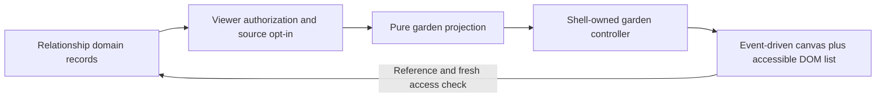
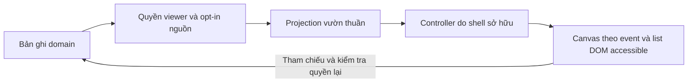

# Garden Integration / Kết nối dữ liệu với khu vườn

## English

### 1. Feature description

Future gradual visual expression of the relationship, not a decorative dashboard chart or relationship-health meter. Potential sources are Mood, Memory, Milestone, Activity, Rule and Anniversary. Exact mechanics/assets are not selected by this specification. Follow [shared conventions](README.md#proposed-engineering-conventions).

### 2. User experience / expected behavior

The approved base garden stays familiar and persistent across navigation. When eligible content is explicitly chosen, a private member view may show a flower for a memory, a special flower for an important memory, an object/tree for a milestone or a sprout for a completed activity. Selecting an item through an accessible DOM list opens the authorized source. A guest continues to see only the approved base garden. No absence streak, withering, apology penalty, menstrual signal, or “bad mood” punishment.

### 3. Functional requirements

MVP integration proposal: one opted-in source type (prefer Memory), stable descriptors and event-driven redraw. Calendar/history remains the source of dates. Projection is rebuildable from domain records and permissions, never the primary relationship database. Mood notes, private journals, period information, and apologies are excluded by default. Later opt-ins require separate policy review; exact flower/tree/sprout imagery and growth rules are Open Design Decisions. No new assets, layout changes or flower SVGs are authorized by this task.

### 4. Architecture

Input source opt-in -> server policy/projection -> authorized descriptor API -> shell-owned controller -> persistent renderer. Suggested `backend/garden-projection.js` owns filtering/mapping; a small shell coordinator may fetch descriptors through `js/auth.js`. `js/background.js` remains the only owner of full-page canvases. Current `mountBackground(container, { signal })` returns cleanup with `update(background)` accepting only `showCharacters`; it does not currently accept source data.

Before implementing, propose a separate projection-update method or an explicit extension to this contract, search every caller and update `js/app.js`, renderer, tests and `docs/interfaces.md` together. Do not put private data in the static tab registry or import renderer from tabs. Shell identity-aware state owns projection request cancellation and clears it on logout/account changes. The existing auth event emitter is identity-specific; domain changes can trigger explicit coordinator refresh after successful writes/view entry, without a generic event bus.

### 5. Suggested data model

Derived `GardenDescriptor { id, sourceType, sourceId, appearanceKey, placementKey, accessibleLabel }`; `GardenProjection { projectionVersion, items[] }`. Stable descriptor IDs/placement keys derive from source ID and mapping version, not personal note content. Only allowed minimal labels reach the client; no hidden mood/period metadata.

Do not store `{ flower, memoryStoryCopy }`. Domain source keeps opt-in and necessary importance/milestone metadata if that field is later approved. Optional future manual placement stores only `{ sourceType, sourceId, position, layoutVersion }` as presentation preferences; it cannot confer source visibility and does not duplicate a Memory. Rebuild after archive/unshare/revoke without stale orphan objects.

### 6. Frontend responsibilities

Keep base canvas instances, layer order, two Loopy behavior, title space, approved raster assets, sidebar/focus and responsive behavior. Projection updates schedule one redraw with existing `requestAnimationFrame` coalescing; image load/resize/settings are existing triggers. No continuous animation loop for MVP. Background is decorative: interactive source access uses a shell-owned accessible DOM list/control, not inaccessible canvas hit zones. Future control ownership must be explicit so tab cleanup cannot remove shell resources.

Cancel/invalidate projection fetches on identity changes and dispose. Immediately clear descriptors on logout/revocation; late responses from the old user cannot restore them. Failed projection fetch leaves base garden intact with a private neutral retry state, never fabricated growth. No private projection cache in localStorage/service workers/static files.

### 7. Backend/API responsibilities

Proposed `GET /api/garden-projection` requires a member session and returns only authorized opted-in descriptors; guest requests receive 401 and frontend uses local base assets. Server computes policy before mapping. No anonymous relationship counts or inferred special flowers from private records. Response uses `Cache-Control: no-store`; authorization checks also apply to descriptor labels, source opening and media. Mapping must be deterministic for same authorized inputs/version and bounded (proposed maximum 100 visible descriptors, deterministic overflow selection).

Projection need not be persisted; caching, if justified later, is keyed by viewer, permission/source revision and mapping version and invalidated on changes. Recompute from current records after restart. Do not persist an independent garden truth or create a write API merely to plant a copy of a source record.

### 8. Important edge cases

No sources, omitted feature, missing asset, corrupt source, archived/revoked Memory, duplicate event notification, many records, logout while image/fetch decoding and resized viewport. Discard inaccessible sources and remove associated DOM labels/counts together. Permission failures use base fallback; source failure cannot make private data public. Mapping-version changes may move objects, so choose stable layout migration behavior before promising saved positions.

### 9. Privacy / permission considerations

Public base garden is separate from relationship projection; auth gating a tab alone cannot protect a shell that exists on public pages. A member may view their own private-source projection only if explicitly designed later; proposed MVP includes only both-member shared, opted-in Memories with live source permission. Period data is excluded even if partner calendar sharing exists. Logout, unshare and revoke must remove all inferable source cues, not just hidden text. No scores, unhealthy/healthy labels or emotional punishment.

**Open Design Decision:** deterministic placement gives rebuildability, consistent layouts and low storage cost; manual placement gives expressive agency but adds layout storage/conflicts/mobile migration. Recommend deterministic first, manual presentation preferences later. Exact mappings/growth and whether approved shared descriptors should ever become public need explicit approval; recommendation is private member descriptors only. Mood-to-visual mappings risk exposing emotions; keep Mood excluded until separate opt-in requirements are reviewed.

### 10. TODO checklist

#### Phase 1 — Domain (MVP)

- [ ] Select one eligible source and approve visual assets/mapping separately.
- [ ] Confirm deterministic placement/private audience, DTO limits and source opt-in policy.

#### Phase 2 — Backend (MVP)

- [ ] Add pure authorized projection function and authenticated read endpoint.
- [ ] Apply current source permissions, deterministic cap/overflow and no-store response.

#### Phase 3 — Frontend (MVP)

- [ ] Review/update background interface and all callers/docs/tests together.
- [ ] Add shell-owned projection refresh/identity clearing and accessible source list.
- [ ] Preserve approved scene and event-driven redraw/cleanup behavior.

#### Phase 4 — Integration

- [ ] Connect selected Memory opt-ins and archive/unshare/revoke invalidation.
- [ ] Add other sources only through separately approved mapping/permission slices.

#### Phase 5 — Tests / later

- [ ] Test projection determinism, guest denial, permission revocation and canvas persistence.
- [ ] Later: assess manual layouts/version migration and optional bounded effects, no default loop.

### 11. Testing requirements

Node: deterministic pure projection, same source one descriptor, current permissions/opt-ins, revoked source exclusions, cap/overflow, no note/period leaks, mapping versions and guest/API policy. Extend `tests/background.test.js` conventions for queued redraw, inactive assets, late handlers, idempotent cleanup and unchanged base fallback. CDP: canvas identity across tab changes, resize matrix, accessible source selection, logout clears all private descriptors, racing account requests and reduced motion. Compare approved garden on guest routes; no production visual claim from build alone.

### 12. Future extensions

Additional approved milestone/anniversary/activity/rule mappings, custom approved raster objects, optional manually placed presentation preferences and history views. Garden growth is qualitative memory of shared life, not a score or separate source database. No automated public sharing, watering mechanic or continuous physics engine is implied.

---

## Tiếng Việt

### 1. Mô tả tính năng

Khu vườn dần biểu diễn mối quan hệ, không chart dashboard trang trí hay đồng hồ sức khỏe tình cảm. Nguồn tiềm năng: Mood, Memory, Milestone, Activity, Rule, Anniversary. Đặc tả chưa chọn cơ chế/asset chính xác. Theo [quy ước chung](README.md#quy-ước-kỹ-thuật-được-đề-xuất).

### 2. Trải nghiệm / hành vi mong đợi

Vườn nền đã duyệt vẫn quen thuộc, tồn tại qua chuyển tab. Khi chủ động chọn nguồn phù hợp, view thành viên riêng có thể hiện hoa cho kỷ niệm, hoa đặc biệt cho kỷ niệm quan trọng, cây/đồ vật cho cột mốc, mầm cho hoạt động xong. Chọn qua list DOM accessible để mở nguồn đúng quyền. Guest chỉ thấy vườn nền. Không streak bỏ lỡ, héo, phạt xin lỗi, tín hiệu kỳ kinh hay phạt mood buồn.

### 3. Yêu cầu chức năng

MVP đề xuất: một loại nguồn opt-in (ưu tiên Memory), descriptor ổn định, vẽ theo event. Lịch/history vẫn sở hữu ngày. Projection dựng lại từ domain/quyền, không database mối quan hệ chính. Mặc định loại note mood/nhật ký riêng/kỳ kinh/xin lỗi. Opt-in sau cần review policy riêng; hoa/cây/mầm và rule lớn lên là quyết định mở. Task này không cho thêm asset/đổi bố cục/tạo hoa SVG.

### 4. Kiến trúc

Opt-in nguồn -> policy/projection server -> API descriptor đúng quyền -> controller shell -> renderer persistent. Gợi ý `backend/garden-projection.js` lọc/map; coordinator shell nhỏ có thể fetch qua `js/auth.js`. `js/background.js` vẫn là owner canvas toàn trang duy nhất. `mountBackground(container, { signal })` hiện trả cleanup có `update(background)` chỉ nhận `showCharacters`, chưa nhận dữ liệu nguồn.

Trước code, đề xuất method update projection riêng hoặc mở rộng contract rõ; tìm mọi caller, cập nhật app/renderer/test/interfaces cùng lúc. Không đặt dữ liệu riêng trong registry tĩnh hoặc import renderer từ tab. State theo identity của shell lo hủy request/xóa projection khi logout/đổi người. Auth emitter chỉ cho identity; write domain thành công/vào view có thể refresh coordinator rõ ràng, không event bus tổng quát.

### 5. Mô hình dữ liệu gợi ý

Suy ra `GardenDescriptor { id, sourceType, sourceId, appearanceKey, placementKey, accessibleLabel }`; `GardenProjection { projectionVersion, items[] }`. ID/placement ổn định từ ID nguồn/version mapping, không note cá nhân. Chỉ nhãn tối thiểu đúng quyền tới client, không metadata mood/kỳ kinh ẩn.

Không lưu `{ flower, memoryStoryCopy }`. Nguồn sở hữu opt-in/metadata importance-milestone nếu field được duyệt sau. Manual placement tương lai chỉ lưu `{ sourceType, sourceId, position, layoutVersion }` như preference trình bày; không cấp quyền nguồn/nhân bản Memory. Dựng lại sau archive/unshare/revoke, không đồ vật mồ côi.

### 6. Trách nhiệm frontend

Giữ canvas nền, layer, hai Loopy, khoảng title, raster asset, sidebar/focus/responsive. Update projection lên lịch một redraw qua RAF coalescing hiện có; ảnh/resize/settings là trigger sẵn. MVP không loop animation. Nền trang trí; mở nguồn bằng list/control DOM shell accessible, không vùng hit canvas không dùng bàn phím. Quyền owner control sau phải rõ để cleanup tab không xóa shell.

Hủy/vô hiệu fetch khi đổi identity/dispose. Xóa descriptor ngay khi logout/thu hồi; response cũ không khôi phục. Fetch projection lỗi giữ vườn nền, retry riêng trung tính, không bịa tăng trưởng. Không cache projection riêng trong localStorage/service worker/file static.

### 7. Trách nhiệm backend/API

Đề xuất `GET /api/garden-projection` cần session thành viên, trả descriptor opt-in đúng quyền; guest 401, frontend dùng base asset local. Policy trước mapping. Không count quan hệ anonymous hoặc hoa đặc biệt suy ra bản ghi riêng. No-store, kiểm tra quyền label/mở nguồn/media. Cùng input đúng quyền/version phải deterministic, giới hạn (đề xuất tối đa 100 descriptor thấy được, chọn overflow ổn định).

Không cần persist projection. Nếu cache có lý do sau, key theo viewer/revision quyền-nguồn/version mapping và invalidation. Restart tính lại từ nguồn. Không lưu nguồn sự thật vườn độc lập hoặc write API chỉ để trồng bản sao nguồn.

### 8. Tình huống biên quan trọng

Không nguồn/tính năng chưa có, asset mất, nguồn lỗi, Memory archive/thu hồi, event báo lặp, nhiều record, logout khi decode/fetch, resize. Loại nguồn sai quyền và xóa cả label/count DOM. Lỗi quyền dùng base fallback; nguồn lỗi không biến private thành public. Đổi mapping có thể đổi vị trí, cần chọn migration layout trước khi hứa giữ vị trí.

### 9. Riêng tư / phân quyền

Vườn public base tách projection quan hệ; khóa tab không bảo vệ shell vẫn nằm trên trang public. Projection nguồn riêng cho owner chỉ nếu được thiết kế riêng về sau; MVP đề xuất chỉ Memory chung cả hai có opt-in và quyền nguồn còn hiệu lực. Loại kỳ kinh kể cả đã share lịch với partner. Logout/unshare/revoke gỡ mọi dấu hiệu suy ra nguồn, không chỉ chữ ẩn. Không score/nhãn khỏe-yếu/phạt cảm xúc.

**Open Design Decision / Quyết định thiết kế còn mở:** vị trí deterministic dựng lại/nhất quán/ít storage; manual cho sáng tạo nhưng thêm lưu layout/conflict/mobile migration. Đề xuất deterministic trước, preference manual sau. Mapping/growth cụ thể và có đưa descriptor public không cần duyệt riêng; đề xuất chỉ thành viên. Mapping mood dễ lộ cảm xúc, loại cho tới khi review opt-in.

### 10. Checklist TODO

#### Giai đoạn 1 — Domain (MVP)

- [ ] Chọn một nguồn, duyệt asset/mapping riêng.
- [ ] Chốt deterministic/private, giới hạn DTO, opt-in nguồn.

#### Giai đoạn 2 — Backend (MVP)

- [ ] Hàm projection thuần đúng quyền, endpoint read authenticated.
- [ ] Quyền hiện tại/opt-in, cap/overflow ổn định, no-store.

#### Giai đoạn 3 — Frontend (MVP)

- [ ] Review/update interface nền và mọi caller/docs/test cùng lúc.
- [ ] Shell refresh/xóa theo identity, list nguồn accessible.
- [ ] Giữ cảnh đã duyệt, redraw theo event/cleanup.

#### Giai đoạn 4 — Tích hợp

- [ ] Opt-in Memory đã chọn, invalidation archive/unshare/revoke.
- [ ] Nguồn khác chỉ theo lát cắt mapping/quyền được duyệt riêng.

#### Giai đoạn 5 — Test / sau

- [ ] Determinism/guest/thu hồi quyền/canvas persistent.
- [ ] Sau: layout manual/migration, hiệu ứng giới hạn, không loop mặc định.

### 11. Yêu cầu kiểm thử

Node: projection thuần ổn định, một nguồn một descriptor, quyền/opt-in hiện tại, nguồn thu hồi, cap/overflow, không note/kỳ kinh, version/guest/API. Mở rộng test background cho redraw queue, asset inactive, callback muộn, cleanup lại, base fallback. CDP: canvas cùng identity qua tab, resize matrix, mở nguồn accessible, logout xóa descriptor riêng, race tài khoản/reduced motion. So vườn guest với cảnh duyệt; build không chứng minh visual production.

### 12. Mở rộng tương lai

Mapping milestone/anniversary/hoạt động/rule được duyệt, raster object riêng, preference đặt thủ công và history. Vườn lớn lên là ký ức định tính về đời sống chung, không score/database nguồn khác. Không tự share public/tưới/physics liên tục.
